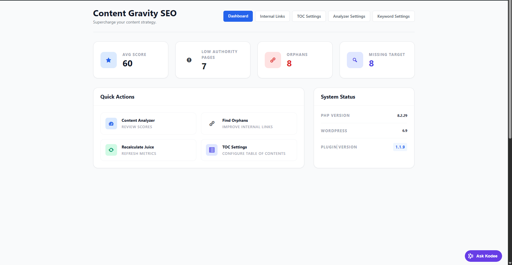
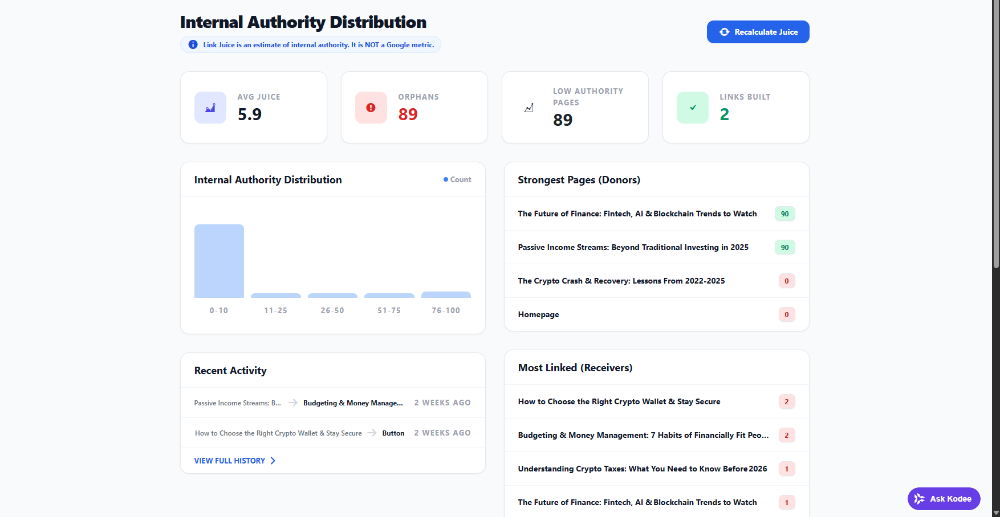
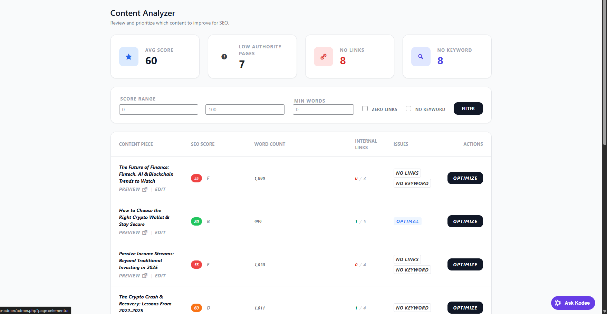
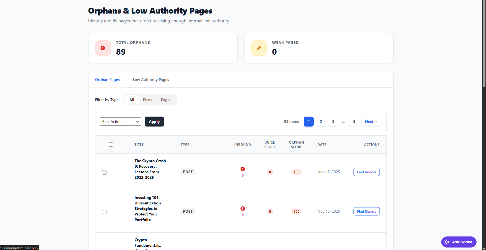

# Content Gravity SEO Toolkit

**Transform your WordPress site's internal linking from chaos to strategy.** A lightweight, all-in-one SEO toolkit that helps you build authority through smarter internal links, content analysis, and auto-generated tables of contents.

---

## Key Features

- **Smart Link Suggestions** — Find the best pages to link from with one-click insertion
- **Link Juice Calculator** — See how authority flows through your site (PageRank-inspired)
- **Orphan Page Finder** — Instantly spot pages with zero inbound links
- **Content Analyzer** — Real-time readability and keyword optimization feedback
- **Auto Table of Contents** — Beautiful, collapsible TOCs from your headings
- **Content Clusters** — Visualize and strengthen your topical authority
- **Broken Link Checker** — Catch 404s before they hurt your rankings
- **Bulk Operations** — Insert links across multiple posts with rollback support

---

## How It Works

1. **Install & Activate** — Upload the plugin and activate in WordPress
2. **Build Your Link Index** — One click maps all internal links on your site
3. **Get Recommendations** — See exactly where to add links for maximum impact
4. **Insert & Track** — Add links with one click, with full rollback capability

---

## Screenshots

---

## Requirements

- WordPress 6.0+
- PHP 7.4+
- MySQL 5.6+
- Works with Gutenberg, Classic Editor, and Elementor

---

## Documentation

Full documentation included in the `/docs` folder:

- [Installation Guide](docs/installation.md)
- [Usage Guide](docs/usage.md)
- [Full Documentation](documentation.md)

---

## Limitations

We believe in transparency. See [limitations.md](docs/limitations.md) for:

- Known edge cases with certain page builders
- Large site performance considerations
- Feature scope boundaries

---

## Support

- **Documentation**: Comprehensive guides included with purchase
- **Support Portal**: contact@fusionflare.site
- **Response Time**: 24–48 business hours

---

## License

Sold exclusively on CodeCanyon under the [Envato Regular License](https://codecanyon.net/licenses/standard).

© 2025 Content Gravity. All rights reserved.
